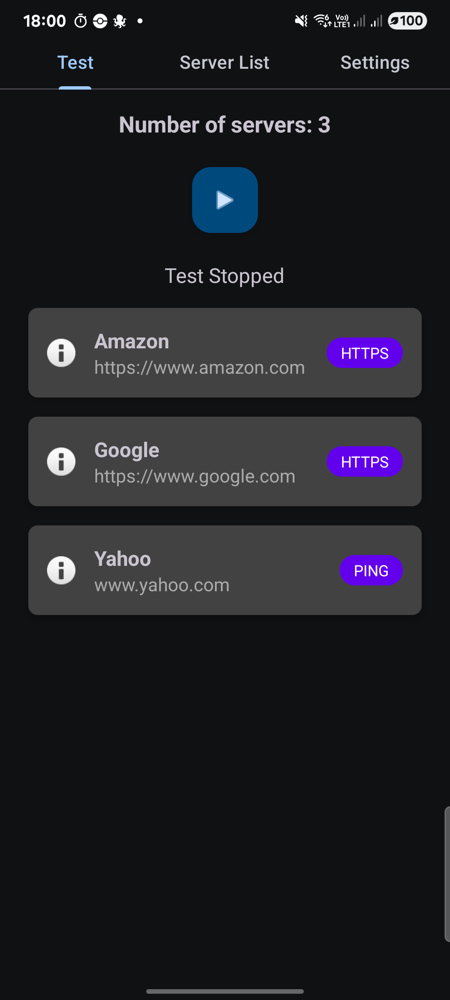
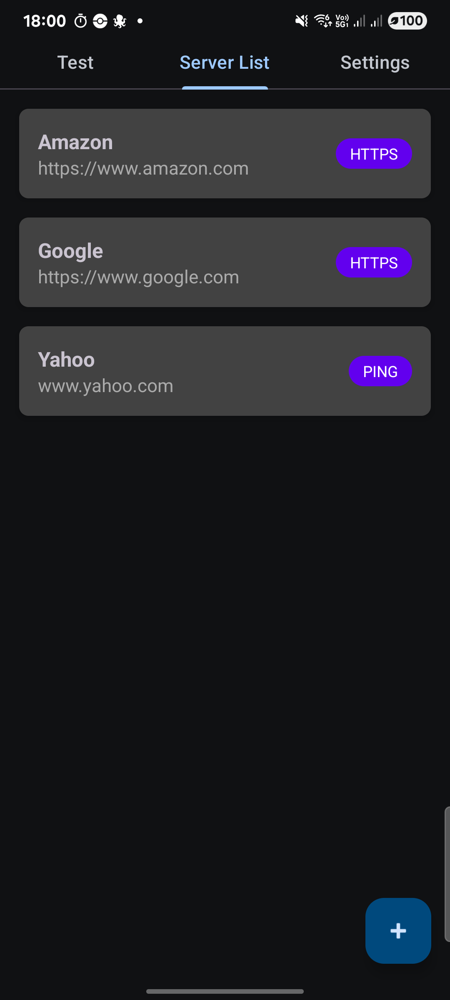
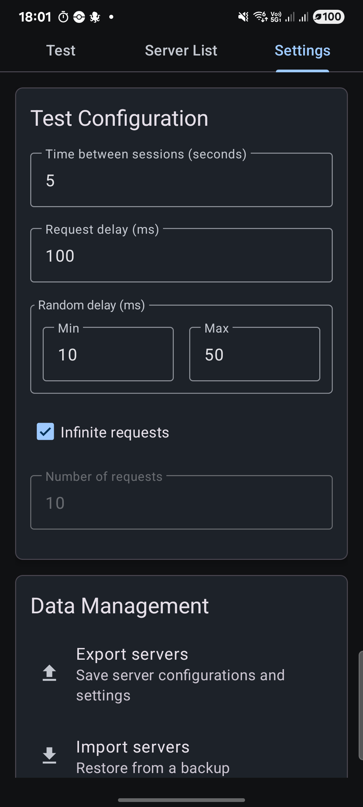

# 🚀 Server Response Test

<p align="center">
  
  
  
  
</p>

<p align="center">
  <strong>A powerful Android application for testing server response times and monitoring network performance</strong>
</p>

---

## 📱 Overview

Server Response Test is a comprehensive Android application designed for network administrators, developers, and IT professionals who need to monitor server performance and response times. The app provides real-time testing capabilities with detailed analytics and customizable test parameters.

## ✨ Key Features

### 🎯 **Multi-Protocol Testing**
- **HTTPS Testing**: Full HTTP/HTTPS request monitoring with detailed response analysis
- **Ping Testing**: ICMP ping tests for basic connectivity verification
- **Flexible Configuration**: Switch between protocols per server with ease

### ⚡ **Advanced Test Configuration**
- **🕐 Customizable Intervals**: Set time between test sessions (1-999+ seconds)
- **⏱️ Request Delays**: Fine-tune request timing (1-9999+ milliseconds)
- **🎲 Random Delays**: Add randomization with min/max delay ranges
- **🔄 Session Control**: Choose between infinite testing or fixed request counts

### 📊 **Real-Time Monitoring**
- **📈 Live Status Updates**: Real-time server response monitoring
- **⏳ Countdown Timer**: Visual feedback for next test cycle
- **🔴 Status Indicators**: Clear success/failure indicators per server
- **📱 Background Processing**: Continue testing while using other apps

### 💾 **Data Management**
- **📤 Export/Import**: JSON-based configuration backup and restore
- **🔄 Share Configurations**: Share server setups with team members
- **💿 Database Storage**: Persistent settings with automatic synchronization
- **🗂️ Version-Aware Storage**: Support for Android 7+ with optimized file handling

### 🛠️ **User Experience**
- **🌍 Multi-Language Support**: Full internationalization (English/French)
- **🎨 Material Design 3**: Modern, responsive UI with dark/light theme support
- **📋 Smart Forms**: Auto-capitalization, input validation, and error handling
- **⚡ Performance Optimized**: Debounced inputs, efficient database operations

### ⚠️ **Safety & Control**
- **🛡️ Danger Zone**: Secure database reset with confirmation dialogs
- **🔒 Input Validation**: Comprehensive form validation and error prevention
- **⚙️ Auto-Save**: Settings automatically saved as you type
- **📱 Responsive Design**: Optimized for various screen sizes and orientations

---

## 🏗️ Architecture

### 🎯 **Modern Android Stack**
- **Room Database**: Local data persistence with migrations
- **LiveData + ViewModel**: Reactive UI architecture
- **Material Design 3**: Latest design system implementation
- **ViewPager2**: Smooth tab navigation
- **RecyclerView**: Efficient list management

### 📦 **Project Structure**
```
📁 Server Response Test/
├── 📁 data/           # Database entities, DAOs, and models
├── 📁 repository/     # Data access layer
├── 📁 viewmodel/      # UI state management
├── 📁 fragment/       # UI fragments (Test, Server List, Settings)
├── 📁 adapter/        # RecyclerView adapters
├── 📁 service/        # Background testing service
└── 📁 ui/            # Custom UI components
```

---

## 🚀 Getting Started

### 📋 **Prerequisites**
- Android Studio Arctic Fox or later
- Android SDK API 24+ (Android 7.0)
- Java 8 or higher

### 🔧 **Installation**
1. **Clone the repository**
   ```bash
   git clone https://github.com/your-repo/server-response-test.git
   ```

2. **Open in Android Studio**
   - Import the project
   - Sync Gradle dependencies
   - Build and run on device/emulator

3. **Build APK**
   ```bash
   ./gradlew assembleDebug
   ```

---

## 📱 Usage Guide

### 1️⃣ **Adding Servers**
- Navigate to the **Server List** tab
- Tap the **➕** button to add a new server
- Fill in server details:
  - **Name**: Descriptive server name (auto-capitalized)
  - **Address**: HTTPS URL or IP address
  - **Port**: Optional port number
  - **Type**: Choose HTTPS or Ping

### 2️⃣ **Configuring Tests**
- Go to the **Settings** tab
- Adjust test parameters:
  - **Time between sessions**: Interval between test cycles
  - **Request delays**: Fine-tune timing
  - **Random delays**: Add randomization
  - **Request count**: Set finite or infinite testing

### 3️⃣ **Running Tests**
- Switch to the **Test** tab
- Tap **▶️ Start Test** to begin monitoring
- Watch real-time status updates
- Use **⏹️ Stop Test** to end testing

### 4️⃣ **Managing Data**
- **Export**: Backup server configurations and settings
- **Import**: Restore from previous backups
- **Share**: Send configurations to team members
- **Reset**: Clear all data (with safety confirmation)

---

## 🎨 Screenshots

<p align="center">
  
  
  
</p>

---

## 🛠️ Technical Features

### 📊 **Performance Optimizations**
- **Debounced Text Watchers**: Prevents excessive database calls during typing
- **Background Processing**: Non-blocking UI operations
- **Memory Management**: Proper resource cleanup and leak prevention
- **Efficient Queries**: Optimized database operations with proper indexing

### 🌐 **Storage Compatibility**
- **Android 7-9**: Legacy external storage with permissions
- **Android 10+**: Scoped storage with Storage Access Framework
- **JSON Format**: Human-readable configuration files
- **Backward Compatibility**: Supports old and new export formats

### 🎯 **Material Design Implementation**
- **Dynamic Font Sizing**: Auto-adjusting text for different languages
- **Theme-Aware Components**: Consistent styling across light/dark themes
- **Responsive Layouts**: Optimized for various screen sizes
- **Accessibility**: Full support for screen readers and accessibility services

---

## 🌍 Internationalization

Currently supported languages:
- 🇺🇸 **English** (default)
- 🇫🇷 **French** (Français)

### Adding New Languages
1. Create new `values-{language}` directory
2. Translate `strings.xml` file
3. Test UI layout with longer text strings
4. Submit pull request

---

## 🤝 Contributing

We welcome contributions! Please see our [Contributing Guidelines](CONTRIBUTING.md) for details.

### 🐛 **Bug Reports**
- Use GitHub Issues with bug report template
- Include device info, Android version, and logs
- Provide steps to reproduce the issue

### 💡 **Feature Requests**
- Open GitHub Issue with feature request template
- Describe the use case and expected behavior
- Include mockups or examples if applicable

### 🔧 **Pull Requests**
- Fork the repository
- Create feature branch: `git checkout -b feature/amazing-feature`
- Commit changes: `git commit -m 'Add amazing feature'`
- Push to branch: `git push origin feature/amazing-feature`
- Open Pull Request

---

## 📄 License

This project is licensed under the MIT License - see the [LICENSE](LICENSE) file for details.

---

## 🎖️ Acknowledgments

- **Material Design Team** for excellent design guidelines
- **Android Jetpack** for modern architecture components
- **Room Database** for robust local storage
- **Community Contributors** for feedback and improvements

---

## 📞 Support

- 📧 **Email**: support@serverresponsetest.com
- 🐛 **Bug Reports**: [GitHub Issues](https://github.com/your-repo/server-response-test/issues)
- 📖 **Documentation**: [Wiki](https://github.com/your-repo/server-response-test/wiki)
- 💬 **Discussions**: [GitHub Discussions](https://github.com/your-repo/server-response-test/discussions)

---

<p align="center">
  <strong>Made with ❤️ for network monitoring professionals</strong>
</p>

<p align="center">
  
  
  
</p>